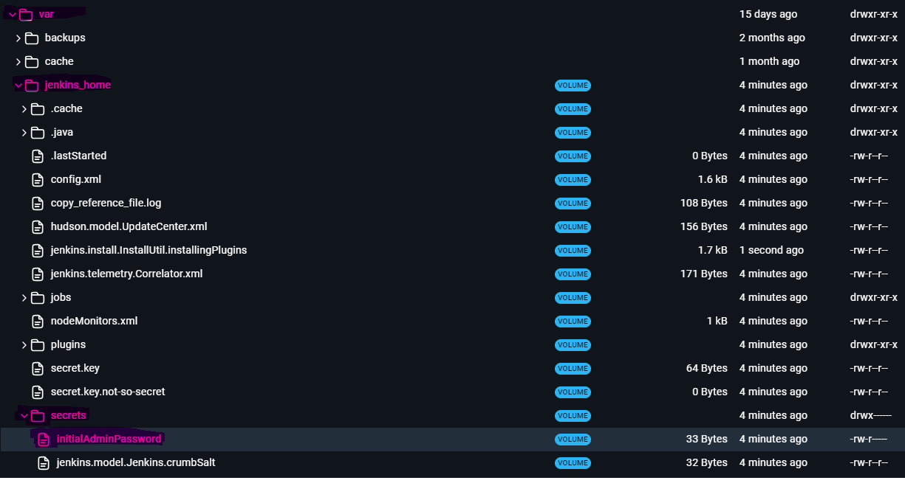
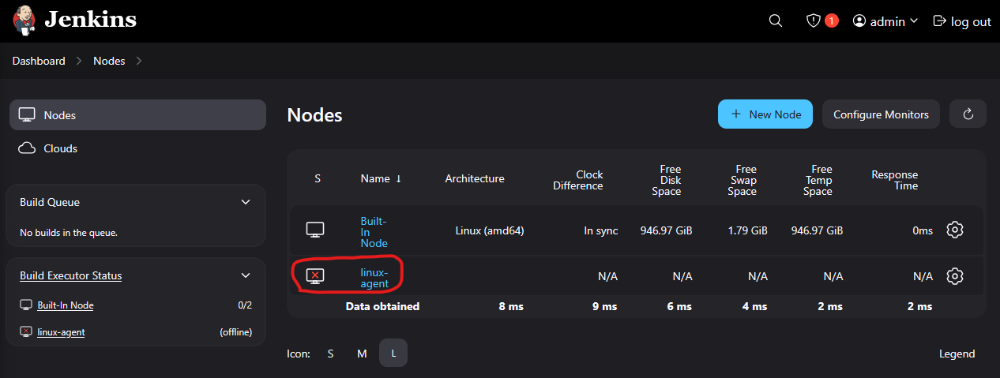
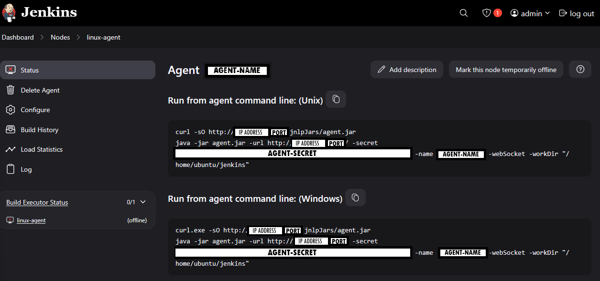

# Jenkins setup with docker

- [Set up Jenkins Server](#set-up-jenkins-server)
- [Set up Jenkins Client](#set-up-jenkins-client)
- [Extra](#extra)
    - [Custom agents](#custom-agents)
    - [Why not docker compose?](#why-not-set-up-through-docker-compose)

## Set up Jenkins Server
Setting up the Jenkins server is the most important part. The following command will download and install the Jenkins server and set it up automaticlly.

```bash
docker run --detach --volume jenkins_home:/var/jenkins_home --name jenkins-server --publish 8080:8080 --publish 50000:50000 --restart=on-failure jenkins/jenkins:lts-jdk17
```
| VALUE                                         | DESCRIPTION                                       |
| :--                                           | :--                                               |
| `--volume jenkins_home:/var/jenkins_home`     | Mounts docker volume to a path in the container   |
| `--name jenkins-server`                       | Gives the container the name `jenkins-server`     |
| `--publish 8080:8080` `--publish 50000:50000` | Opens port 8080 to access the server through the webbrowser [localhost:8080](http://localhost:8080) and port 50000 that the agents will use to communicate with the jenkins server. |
| `--restart=on-failure`                        | When/if the server runs into an error it will automaticlly restart, due to the volume mount no data will be lost |
| `jenkins/jenkins:lts-jdk17`                   | The LTS image the server will be using |

All you have to do is go to [localhost:8080](http://localhost:8080) in your webrowser and go throught the admin account setup which allows you to access the server and set up all plugins that you might want. When you use the `--detach` flag the logs will not appear in your terminal which means that the `initialAdminPassword` will not be displayed. To get this and start the setup of the Jenkins server you need to access the container and find a text file in `/var/jenkins_home/secrets/initialAdminPassword`.



Do as the installation wizard tells you.

Now you can run your pipelines and set up your CI/CD workflow. Althogh Jenkins do recommend you to have an agent set up for safety reason, what this most likely refere to is that incase a developer creates code that could shut down the agent it runs on it would turn off the entire server instead of just a seperate agent.

So how do you set up an agent?

## Set up Jenkins Client
On the Jenkins dashboard you should be able to see a option called "Set up an agent". Click on it and under "Node name" give your agent a name.

> [!NOTE]
> Throught out the Jenkins interface when referring to an agent or node know that it often referes to a seperate machine. Throughout this guide agents and nodes will be refered to as "agents".

After creating the agent you will be promted with multiple fields, you can play around with these as you please and configure them as you wish. The important parts here are the following fields:

| FIELD | VALUE |
| :--   | :--   |
| Remote root directory | `/home/ubuntu/jenkins` |
| Launch method         | `Launch agent by connecting it to the controller` |

Press "save" and you will now see that you've created an agent with the name you gave it. 


Now to activate the agent when running the command bellow, fill the gaps with the corresponding values:


``` bash
docker run -d --init jenkins/inbound-agent -url http://<IP-ADDRESS>:<PORT>/ <AGENT-SERCET> <AGENT-NAME>
```
|   VALUE           | DESCRIPTION                                                                                        |
|   :--             |    :--                                                                                             |
|`<IP-ADDRESS>`     | The actual IP address that your jenkins server is hosted on. (**NOT LOCALHOST**)                   |
|`<PORT>`           | The port you've hosted the jenkins server on. (default is 8080)                                    |
|`<AGENT-SECRET>`   | The agent secreat that is displayed on the jenkins server under `Dashboard > Nodes > <AGENT_NAME>` |
|`<AGENT-NAME>`     | The name you gave the agent in the jenkins server UI                                               |
> [!TIP] Why doesn't "localhost" work as an IP-address?
> Due to how virtualization works, when refering to "localhost" the system will refere to it's internal network. Which means that when you host a docker container you can reach it with localhost from your webbrowser becuse it acts as a router for your container, but your containers do not nessesarly know that the other ones exists.
>
> ***TL;DR:*** localhost referes to the machine itself, host and containers.

Remember that the agent secret and agent name needs to match, otherwise the agent will not connect correctly. The name of the container does not have to be the same as the angent but is recommended to keep it consistant.

Now you can create as many agents as you need, but before you start the them you need to regester them as new agents on the server. You can try to create your own pipeline and try to run any operations. Remember to specify your new agent as the active node to use.

**Example:**
``` groovy
pipeline {
    agent { node { <AGENT-NAME> } } //Replace <AGENT-NAME> with the name of your agent (not the container name)

    stages ('Print text') {
        stage('Print hello') {
            echo 'hello'
        }
    }
}
```

When running commands in the pipeline, remember that it uses `bash` unless it calles a specific program. That means if you want to run specific scripts or actions you usually have to write `sh` before the command you want to specify.

## Extra

### Custom agents
The great thing about docker is that you can build your own images on top of already exisitng images by making a `Dockerfile`.

To start creating a docker file you need to begin by creating the `Dockerfile` itself and use the base `jenkins/inbound-agent`.
``` Dockerfile
FROM jenkins/inbound-agent

COPY <source/path> <path/in/container>
```

This will take whatever directory in your system (relative to where the Dockerfile exists) and copies the directory into the container. When if you run `docker build -t <my-jenkins-agent> .` in the directory the file exist it will create a new docker image that you can call instead of `jenkins/inbound-agent` that has the same properties and can be launched in the same way as the official image.

You can group multiple agents with each other under the same lable that you can specify in your pipeline script. This will tell Jenkins to pick the first best available 

### Why not set up through docker compose?
Due to how how Jenkins links agents that is not possible at the time. You manually have to register an agenet and then link it. This is due to the secret of the agent is generated when the agent is registered. This means that you can't create them along side each other and need to create one at the time.